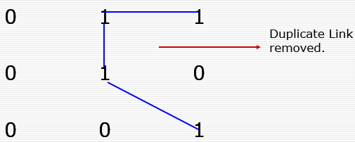
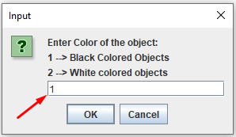
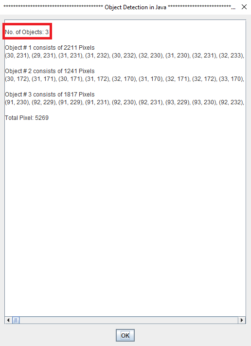

# Object Detection java

## Table of Contents
* <a href = "#Overview_Head" > Overview </a> 

* <a href = "#Installation" > How to Install and Run the Project </a> 

* <a href = "#FileContent" > File Contents </a> 

* <a href = "#Int" > Introduction </a> 

  * <a href = "#Neighbour" > Neighbourhood </a>
    * <a href = "#4neighbours" > 4-Neighbours </a> 
    * <a href = "#Dneighbours" >  D-Neighbours </a>
    * <a href = "#8neighbours" > 8-Neighbours </a>
          
  * <a href = "#Connectivity" > Connectivity </a>
    * <a href = "#4connectivity" > 4-Connectivity </a> 
    * <a href = "#8connectivity" >   8-Connectivity </a>
    * <a href = "#Mconnectivity" >   M-Connectivity </a>
   
* <a href = "#Scr" > Program Screenshots </a>  
         
## 
 Overview 
       

It is a Java based GUI desktop application which “detects the objects in a binary image using the concept of Neighborhood and connectivity”. More specifically it implements the concept of "M-Connectivity" of Digital Image Processing.

## 
 How to Install and Run the Project 

#### 
 Method # 1: Download 'Executable (exe)' file from 'PORTABLE APPLICATION' Folder (Easy & Portable) 

                No need to install anything but it is for WINDOWS OS  
                
#### 
 Method # 2: Download and Load Project in Eclipse IDE to Run it 

                Eclipse IDE & JVM will be required.

## 
 File Contents  

- `src/Application/ObjectDetection.java` includes the implementation of neighbourhood & connectivity concept (main logic).  
- `src/com/test/jfilepicker package` includes source files for GUI components.
- `src/com/test/jfilepicker package/images package` includes the binary images.

## 
 Introduction 

### 
 1-Neighborhood 

A Digital Image comprises of a 2D matrix, and every element is called as Pixel.
The Image is denoted by f(x,y) and any pixel can be denoted by small letter, say p, q …
Every Pixel has some Neighbors located around it.

Different types of neighbors include:
4 Neighbors
D Neighbors
8 Neighbors

#### 
 4-Neighbors 

A pixel ’p’ located at coordinate value (x,y) has 4 neighbors, which are adjacent to ‘p’.
The coordinate values can be determined as:
(x+1,y)
(x-1,y)
(x,y+1)
(x,y-1)
by N4(p) 4 Neighbors are denoted

 

 

 
 

  <figcaption align = "center"> 4-Neighbors  </figcaption>
 

#### 
 (ii) D-Neighbors 

A pixel ’p’ located at coordinate value (x,y) has D neighbors, which are located in Diagonal of  ‘p’.
The coordinate values can be determined as:
(x+1,y+1)
(x+1,y-1)
(x-1,y+1)
(x-1,y-1)
8 Neighbors are denoted by N8(p)

 

 

 
 

  <figcaption align = "center"> D-Neighbors  </figcaption>
 

#### 
 (ii) 8-Neighbors 

A pixel ’p’ located at coordinate value (x,y) has 8 neighbors, which are combination of 4 and D Neighbors.
8 Neighbors are denoted by N8(p)

(x+1,y)
(x-1,y)
(x,y+1)
(x,y-1)
(x+1,y+1)
(x+1,y-1)
(x-1,y+1)
(x-1,y-1)

 

 
 

  <figcaption align = "center"> 8-Neighbors  </figcaption>
 

### 
 Connectivity 

Connectivity between pixels is an important concept used in establishing boundaries of objects and components of regions in an image. 

As we can identify different objects in Image depending upon the Intensity values of Pixels.

So all Pixels comprising an object would have Same or Close values.

To establish whether two pixels are connected, it must be determined 

If they are adjacent in some sense (say, if they are 4-neighbors) .
and
If their grey levels satisfy a specified criterion of similarity.

The specified Criteria (Intensity Range ) can be defined by defining a set ‘V’ at start.
For V={2}
Only those Pixel can be connected which have value =2
For V={1,2}
Only those Pixel can be connected which have value =1 or 2.
The specified Criteria (Intensity Range ) can be defined by defining a set ‘V’ at start.

#### 
 (i) 4-Connectivity: 

 

 
 

  <figcaption align = "center"> 4-Connectivity  </figcaption>
 

Two pixels p and q with values from V are 4- connected if q is in the set N4 (p).

#### 
 (ii) 8-Connectivity: 

 

 
 

  <figcaption align = "center"> 8-Connectivity  </figcaption>
 

Two pixels p and q with values from V are 8- connected if q is in the set N8 (p). 
      
#### 
 (ii) M-Connectivity: 

Two pixels p and q with values from V are m-connected if:
       q is in N4 (p), 	OR
       q is in ND (p) AND the set  N4 (p) ∩  N4 			(p) is empty.

 

 
 

  <figcaption align = "center"> M-Connectivity  </figcaption>
 

## 
  Program Screenshots 

 

 
 

  <figcaption align = "center"> Fig-A: Browsing image </figcaption>
 
  
 
 

 

 
 

  <figcaption align = "center"> Fig-B: Selecting an image </figcaption>
 
  
 
 

 

 
 

  <figcaption align = "center"> Fig-C: Specifying color of object  </figcaption>
 
  

 

 

 
 

  <figcaption align = "center"> Fig-D: Result  </figcaption>
 

 
 
